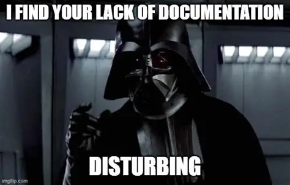

# Windows APP V.3

- [AimaCAM](https://github.com/aima-beyond-ai/nssm-aima-cam) AiMA Webcam capture
- [AimaCRON](https://github.com/aima-beyond-ai/nssm-aima-cron) AiMA Cron tasks
- [AimaLLM](https://github.com/aima-beyond-ai/nssm-aima-llm) AiMA Brain llm model
- [AimaPRO](https://github.com/aima-beyond-ai/nssm-aima-pro) AiMA Proactive mode
- [AimaSTT](https://github.com/aima-beyond-ai/nssm-aima-stt) AiMA Speech to text
- [AimaSYNC](https://github.com/aima-beyond-ai/nssm-aima-sync) AiMA Local and remote redis sync
- [AimaTTS](https://github.com/aima-beyond-ai/nssm-aima-tts) AiMA Text to speech
- [AimaVAD](https://github.com/aima-beyond-ai/nssm-aima-vad) AiMA Voice activity detection
- [AimaVIEW](https://github.com/aima-beyond-ai/nssm-aima-view) AiMA Brain llm view
- [AimaWS](https://github.com/aima-beyond-ai/nssm-aima-ws) AiMA Websocket local for Unreal
- [AimaWSS](https://github.com/aima-beyond-ai/nssm-aima-wss) AiMA Websocket server backend

# Windows APP V.2

- [gitlab.com/linkemann/aima-beyond-ai/app-hybrid-windows](https://gitlab.com/linkemann/aima-beyond-ai/app-hybrid-windows)

# Windows APP V.1

- [@aima-beyond-ai/app-server](https://github.com/aima-beyond-ai/app-server)
- [@aima-beyond-ai/app-brain](https://github.com/aima-beyond-ai/app-brain)
- [@aima-beyond-ai/app-ear](https://github.com/aima-beyond-ai/app-ear)
- [@aima-beyond-ai/app-view](https://github.com/aima-beyond-ai/app-view)
- [@aima-beyond-ai/app-cvemo](https://github.com/aima-beyond-ai/app-cvemo)

---

# EC2 Servers

- [@aima-beyond-ai/server-global](https://github.com/aima-beyond-ai/server-global)
- [@aima-beyond-ai/server-google](https://github.com/aima-beyond-ai/server-google)
- [@aima-beyond-ai/server-oauth](https://github.com/aima-beyond-ai/server-oauth)
- [@aima-beyond-ai/server-websocket](https://github.com/aima-beyond-ai/server-websocket)

## SSL

- [@aima-beyond-ai/certificates](https://github.com/aima-beyond-ai/certificates)

---

# NodeJS packages

## Core

- [@aima-beyond-ai/worker](https://github.com/aima-beyond-ai/worker)
- [@aima-beyond-ai/queue-sorted](https://github.com/aima-beyond-ai/queue-sorted)
- [@aima-beyond-ai/garbage-collector](https://github.com/aima-beyond-ai/garbage-collector)
- [@aima-beyond-ai/payload](https://github.com/aima-beyond-ai/payload)
- [@aima-beyond-ai/credentials](https://github.com/aima-beyond-ai/credentials)
- [@aima-beyond-ai/token](https://github.com/aima-beyond-ai/token)
- [@aima-beyond-ai/user](https://github.com/aima-beyond-ai/user)

## AWS

- [@aima-beyond-ai/aws-lex](https://github.com/aima-beyond-ai/aws-lex)
- [@aima-beyond-ai/aws-polly](https://github.com/aima-beyond-ai/aws-polly)
- [@aima-beyond-ai/aws-rds](https://github.com/aima-beyond-ai/aws-rds)
- [@aima-beyond-ai/aws-ses](https://github.com/aima-beyond-ai/aws-ses)
- [@aima-beyond-ai/aws-s3](https://github.com/aima-beyond-ai/aws-s3)

## Ai

- [@aima-beyond-ai/openai](https://github.com/aima-beyond-ai/openai)

## Helpers

- [@aima-beyond-ai/env](https://github.com/aima-beyond-ai/env)
- [@aima-beyond-ai/sandbox](https://github.com/aima-beyond-ai/sandbox)
- [@aima-beyond-ai/geoid](https://github.com/aima-beyond-ai/geoid)
- [@aima-beyond-ai/google-connect](https://github.com/aima-beyond-ai/google-connect)
- [@aima-beyond-ai/authorization](https://github.com/aima-beyond-ai/authorization)
- [@aima-beyond-ai/roles](https://github.com/aima-beyond-ai/roles)
- [@aima-beyond-ai/scopes](https://github.com/aima-beyond-ai/scopes)
- [@aima-beyond-ai/endpoint](https://github.com/aima-beyond-ai/endpoint)
- [@aima-beyond-ai/webcam](https://github.com/aima-beyond-ai/webcam)
- [@aima-beyond-ai/models](https://github.com/aima-beyond-ai/models)

## Tools

- [@aima-beyond-ai/encrypt](https://github.com/aima-beyond-ai/encrypt)
- [@aima-beyond-ai/ffmpeg](https://github.com/aima-beyond-ai/ffmpeg)
- [@aima-beyond-ai/duration](https://github.com/aima-beyond-ai/duration)
- [@aima-beyond-ai/logs](https://github.com/aima-beyond-ai/logs)
- [@aima-beyond-ai/version](https://github.com/aima-beyond-ai/version)

## Development

- [@aima-beyond-ai/package](https://github.com/aima-beyond-ai/package)
- [@aima-beyond-ai/test](https://github.com/aima-beyond-ai/test)